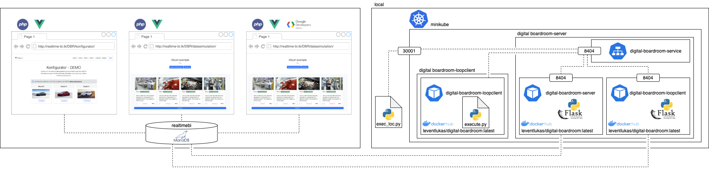

# digital-boardroom
Die Archtiektur dieses Projektes ist folgendermaßen aufgebaut:

Neben dem Kubernetes Deployment gibt es die interaktivere Möglichkeit mit Docker-Compose. Nachfolgend wird zunächst das Kubernetes Setup erläutert, anschließend das Docker-Compose setup. Zuletzt finden sich generelle Notizen der Entwickler.

## Systemanforderungen & Generelles
Es werden keine besonderen Systemanforderungen gestellt.
Allerdings wird eine lokale Kubernetes Installation benötigt (bspw. Minikube). Alternativ ist eine Docker Installation ausreichend. Es wird [Docker Desktop](https://docs.docker.com/desktop/) empfohlen, da hier Kubernetes mitgeliefert wird. Es wird erwartet, dass kubectl installiert und so konfiguriert ist, dass es mit dem lokalen cluster interagiert.

In beiden Methoden werden die Verbindungsinformationen durch den Server über die Environment geladen. Bei verwendung anderer Zugangsdaten, sollten diese ersetzt werden.

## k8s-Setup
Im Kubernetes-Setup werden zwei Server-Instanzen gestartet, die über einen NodePort-Service exposed werden. Zusätzlich wird per default ein loopclient gestartet, der in einer Iteration von 3 Sekunden den Simulationsservice konsumiert.

Es wird eine aktuelle und finale Version des verwendeten Dockerimages über Dockerhub bereitsgestellt. Wie im deployment.yaml zu erkennen, nutzen alle pods das gleiche Image unter verwendung unterschiedlicher Entry-Points. Das Repository [leventlukas/digitalboardroom](https://hub.docker.com/repository/docker/leventlukas/digital-boardroom) sollte frei verügbar sein. Daher reicht es das k8s deployment zu starten.

```
kubectl apply -f ./deployment.yaml
```

```
deployment.apps/digital-boardroom-server created
service/digital-boardroom-service created
deployment.apps/digital-boardroom-loopclient created
```

Verifizierung, dass die Pods erfolgreich gestartet wurden:

```
kubectl get pods
```

```
NAME                                            READY   STATUS    RESTARTS   AGE
digital-boardroom-loopclient-7fc59457b6-p6trd   1/1     Running   0          2m10s
digital-boardroom-server-548c47b446-bdrgl       1/1     Running   0          2m10s
digital-boardroom-server-548c47b446-dn6fp       1/1     Running   0          2m10s
```
Um das Deployment wieder zu entfernen:
```
kubectl delete deployment digital-boardroom-loopclient
```
```
deployment.apps "digital-boardroom-loopclient" deleted
```
Nachdem das loopclient Deployment entfernt wurde ist es möglich den Service über das Skript exec_loc zu adressieren. Das skript erwartet 1-2 Argumente. Das erste bestimmte die Sekunden für jedes Intervall und das zweite die Menge an Intervallen. Wird das zweite Argument nicht gesetzt läuft die Schleife bis zu einem Interrupt. Für die lokale Ausführung werden weitere Pyhton Packages benötigt.  
```
python execute_loc.py 3 1
success
```
Werden die Server nicht mehr benötigt kann das Deplyoment gelöscht werden:
```
kubectl delete deployment digital-boardroom-server
```
```
deployment.apps "digital-boardroom-server" deleted
```
Zuletzt noch den Service entfernen:
```
kubectl delete service digital-boardroom-service
```
```
service "digital-boardroom-service" deleted
```

(Für die Entwicklung)
```
docker build -t leventlukas/digital-boardroom:latest -f ./k8s.Dockerfile .
docker push leventlukas/digital-boardroom:latest
```

## Docker-Compose Setup
Das Docker-Compose Setup bietet eine höhere Flexibilität für die Entwicklung, da der Ordner Code direkt in den Container gemountet wird. Das Deployment ist so konfiguriert, dass der gleiche Port wie das Kubernetes Deployment lokal exportet wird. Es kann also auch hier das Client-Skript exec_loc.py verwendet werden.
Es werden drei Terminal-Prozesse benötigt:
1. Um den Container zu starten:
```
docker-compose up --build
```
2. Um den Server zu Starten, in den Container schalten und Serverskript ausführen:
```
docker exec -it digital-boardroom bash
python server.py
```
```
 * Serving Flask app "server" (lazy loading)
 * Environment: production
   WARNING: This is a development server. Do not use it in a production deployment.
   Use a production WSGI server instead.
 * Debug mode: on
 * Running on http://0.0.0.0:8404/ (Press CTRL+C to quit)
 * Restarting with stat
 * Debugger is active!
 * Debugger PIN: 288-662-258
```
3. Clientskript ausführen:
```
python execute_loc.py 3 1
success
```
# Notizen der Entwickler


| Status | Bedeutung           |
|--------|---------------------|
| 0      | geplant             |
| 1      | Karosserie          |
| 2      | Farbe               |
| 3      | Batterie            |
| 4      | Innenraum und Pilot |
| 5      | Lagernd             |
| 6      | geliefert           |


# Funktion Maschinenablauf

Die Produktion erfolgt nach dem Pull Prinzip. Das bedeutet, dass für jede Maschine in jeder iteration zwei Szenarien geprüft werden müssen.
1. Ist Maschine fertig mit der Produktion (Timestmps prüfen und AutoID != null): Dann wird der Timestamp in Auto.ProdTimestmp und Komponente.Einbau gespeichert. Im Falle der letzten Maschine wird der Status auf 5 (lagernd) gesetzt.
2. Ist die Maschine bereits in der lezten iteration fertig geworden: Dann wird das nächste Auto der Produktionsstrasse der Maschine, das dem status Maschine -1 entspricht, wenn Maschine -1 bereits fertig ist. Das bedeutet für Maschine 4 wenn Auto_ID = null, dann schreibe Auto_ID in Maschine 4 wo Produktionsstrasse, der Maschinenproduktionsstraße entspricht und wo Status 3 ist. Setze außerdem in Auto den Status auf 4
